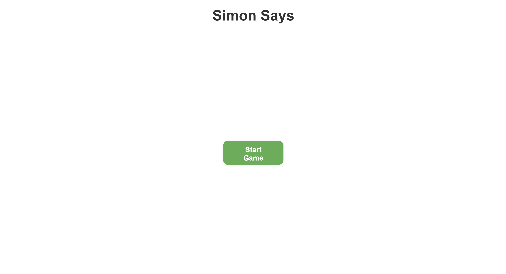
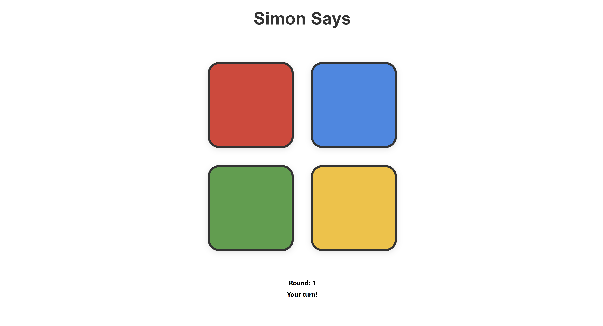
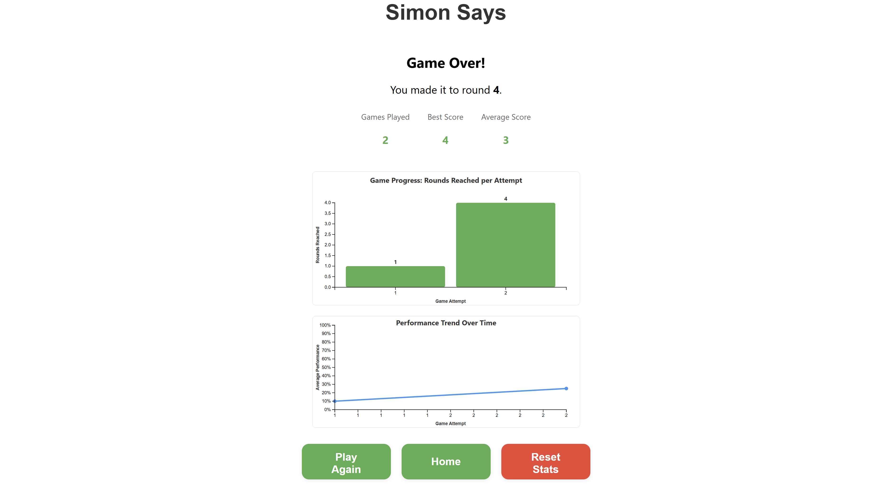

# Simon Says Game

## App Description and Purpose

Simon Says is a modern web-based implementation of the classic memory game that challenges players to remember and replicate sequences of colors and sounds. The application is designed to test and improve memory retention, concentration, and pattern recognition skills through progressively challenging gameplay.

Built with React and TypeScript, this interactive game provides an engaging user experience with visual feedback, audio cues, and comprehensive performance tracking. Players must watch and memorize sequences of colored buttons that light up, then reproduce the exact sequence by clicking the buttons in the correct order.

## Demo Video

Watch our Simon Says game in action: [SIMON SAYS DEMO](https://www.loom.com/share/ea00af52251c4f22926ba1ccdc0b216e?sid=151c94d8-124e-4741-9e84-0a1f4006a7e3)

## Installation and Setup Instructions

### Prerequisites

- Node.js (version 16 or higher)
- npm or yarn package manager

### Setup Steps

1. Clone the repository:

   ```bash
   git clone https://github.com/bhargavvasireddy/simonsays.git
   ```

2. Navigate to the project directory:

   ```bash
   cd simonsays/simonsays_project
   ```

3. Install dependencies:

   ```bash
   npm install
   ```

4. Start the development server:

   ```bash
   npm start
   ```

5. Open [http://localhost:3000](http://localhost:3000) in your browser to play the game.

### Additional Commands

- `npm test` - Run the test suite
- `npm run build` - Build the app for production
- `npm run eject` - Eject from Create React App (one-way operation)

## Screenshots

### Starting Page



### Game Board



### Results Page



## Feature List

### Currently Working Features

✅ **Interactive Gameplay**

- Players follow and replicate sequences of colors and sounds
- Dynamic sequence generation that increases in complexity as players progress
- Real-time audio feedback with distinct tones for each color

✅ **Progress Tracking**

- GameProgressChart component displays player progress and performance
- Historical game statistics and performance metrics
- Local storage persistence of game data

✅ **Responsive Design**

- Optimized for mobile, tablet, and desktop devices
- Consistent gameplay experience across different screen sizes
- Touch-friendly interface for mobile devices

✅ **Results Page**

- Comprehensive performance summary after each game
- Visual charts showing game progress and accuracy
- Statistics including best score, average score, and games played

✅ **Reusable Components**

- Modular architecture with components like ColorButton and SimonBoard
- Maintainable and scalable codebase structure
- Clean separation of concerns

✅ **Basic Testing**

- Unit tests implemented for core functionality
- Testing utilities configured with React Testing Library

### Known Issues or Limitations

❌ **No Multiplayer Mode** - Currently limited to single-player gameplay
❌ **Limited Difficulty Levels** - No option to select different difficulty settings  
❌ **No Leaderboard** - Missing global or local score tracking system
❌ **Accessibility Limitations** - Lacks features for visually or hearing-impaired users
❌ **Static Results Page** - Performance summary doesn't provide advanced analytics
❌ **Testing Coverage** - Existing tests are minimal and don't cover all components

## Technology Stack

### Frontend

- **React.js** (v19.1.1) - UI library for building interactive user interfaces
- **TypeScript** (v4.9.5) - Type-safe JavaScript for better development experience
- **React Router DOM** (v7.7.1) - Client-side routing and navigation

### Data Visualization

- **D3.js** (v7.9.0) - Powerful library for creating interactive charts and graphs

### Styling

- **CSS3** - Custom styling with responsive design principles
- **CSS Grid/Flexbox** - Modern layout techniques

### Development Tools

- **Create React App** - React application scaffolding and build tools
- **React Testing Library** - Testing utilities for React components
- **Jest** - JavaScript testing framework

### Audio

- **Web Audio API** - Native browser API for generating game sounds

## Project Structure

```
src/
├── components/          # Reusable UI components
│   ├── ColorButton.tsx     # Individual game button component
│   ├── SimonBoard.tsx      # Main game board container
│   ├── GameProgressChart.tsx # Performance visualization
│   └── AccuracyChart.tsx   # Accuracy tracking chart
├── pages/              # Page-level components
│   └── ResultsPage.tsx     # Game results and statistics
├── styles/             # CSS styling files
│   ├── app.css            # Main application styles
│   ├── simonBoard.css     # Game board specific styles
│   └── index.css          # Global styles
├── models/             # TypeScript type definitions
├── App.tsx             # Main application component
└── index.tsx           # Application entry point
```

## Future Development Roadmap

### Phase 1 - Enhanced Gameplay

- **Multiplayer Mode**: Implement competitive gameplay between multiple players
- **Difficulty Levels**: Add Easy, Medium, and Hard difficulty options
- **Custom Game Modes**: Time-based challenges and speed rounds

### Phase 2 - User Experience

- **Leaderboard System**: Global and local score tracking with rankings
- **Achievement System**: Badges for milestones like high scores and winning streaks
- **User Profiles**: Personal statistics and progress tracking

### Phase 3 - Accessibility & Customization

- **Enhanced Accessibility**: Colorblind-friendly modes and sound alternatives
- **Theming Options**: Multiple visual themes and customization options
- **Mobile App**: Native mobile application for iOS and Android

### Phase 4 - Advanced Features

- **Advanced Analytics**: Detailed performance insights and improvement suggestions
- **Social Features**: Share scores and challenge friends
- **AI Opponent**: Computer opponent with adjustable difficulty

## Contact Information

**Developer**: Bhargav Vasireddy  
**Email**: bhargavsurya@vt.edu  
**GitHub**: [bhargavvasireddy](https://github.com/bhargavvasireddy)

---

_Built with ❤️ using React and TypeScript_
